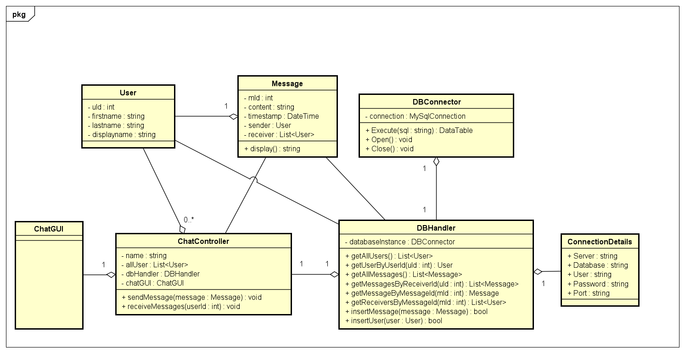
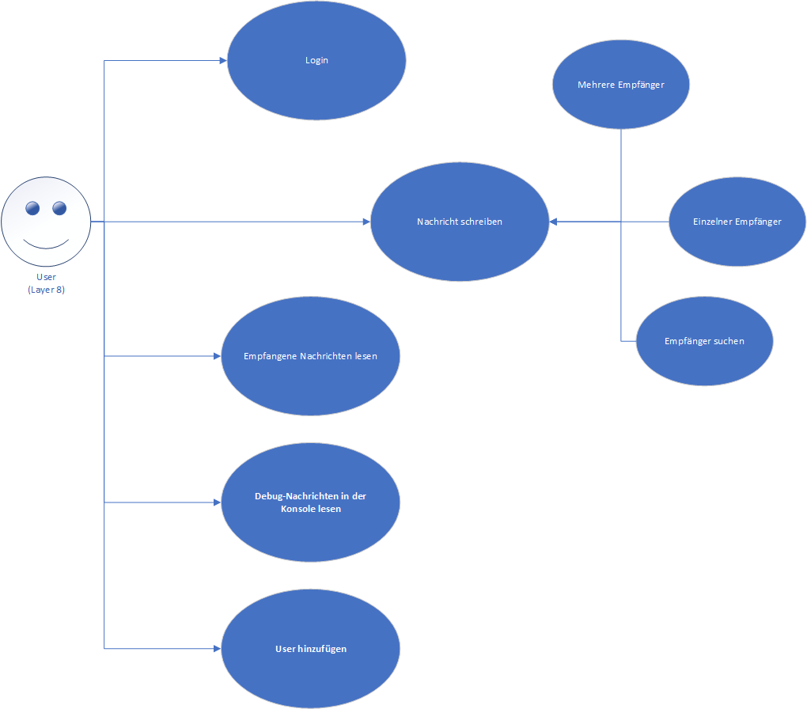

# ChatMail

Schulprojekt von Yannick und Björn.

## UML


## Relations

```
User(uID, vorname, nachname, displayname)
Message(mId, content, timestamp, senderId)
MessageReceiver(Id, mId, rId)
```
[Relationenmodel](relations.txt)

## ERM


## UseCase



## Tests / QM

Um eine gute Qualität der Implementierung, Benutzererfahrung und Dokumentation zu gewährleisten, arbeiten wir mit folgenden Tools:
### Benutzen von Git / GitHub
\> Git

Git ist ein verteiltes Versionskontrollsystem zur Verfolgung von Änderungen im Quellcode während der Softwareentwicklung. Es dient zur Koordinierung der Arbeit zwischen Programmierern, kann jedoch verwendet werden, um Änderungen in einem beliebigen Satz von Dateien zu verfolgen. Zu seinen Zielen gehören Geschwindigkeit, Datenintegrität und Unterstützung für verteilte, nichtlineare Workflows.

Aufgrund der "Branching" Technologie von Git können wir mehrere Versionen unseres Projektes "parallel" speichern. Dies ermöglicht uns eine "Deployment" Version (master) bereitzustellen, die nur gut getestete und fertige Features beinhaltet.

\>  GitHub

GitHub stellt eine moderne Schnittstelle für git-basierte Versionierung bereit und bietet darüber hinaus Tools wie PullRequest-Kontrollen und automatisierte Softwaretests.

### Softwaretests

Softwaretests sind meist automatisierte Scripts, die gewisse Eigenschaften von Sourcecode testen. Hierbei wird zum Beispiel das Kompilieren oder die korrekte Reaktion auf Benutzereingaben überprüft.

\> dotnet build

Hiermit testen wir alle eingehenden PullRequests (Änderungen) auf Kompilierungsfehler. Dies testen wir mit GitHub Actions; GitHub Actions ist ein VM-basiertes Tool, welches automatisch Scripte u.Ä. ausführt, Ergebnisse kontrolliert und entsprechend die Änderungen als fehlerhaft und gültig markiert.

\> Unittests

Desweiteren verwenden wir Unittests, die die korrekte Funktion des Datenbankkonnektors, Frontend, u.Ä. überprüft.

\> Integrationtest

Ein Integrationtest spiegelt die Kombination mehrere Unittests gleichzeitig wieder. Hierbei wird also die korrekte Funktion der Einheiten (Units) untereinander überprüft.

## Misc

Ein SQL Dump unserer Datenbankstruktur finden Sie [hier](sql_dump.sql).
